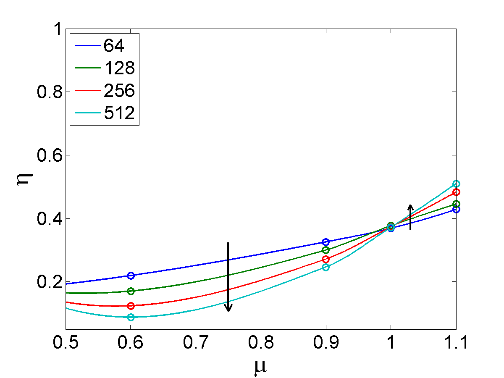
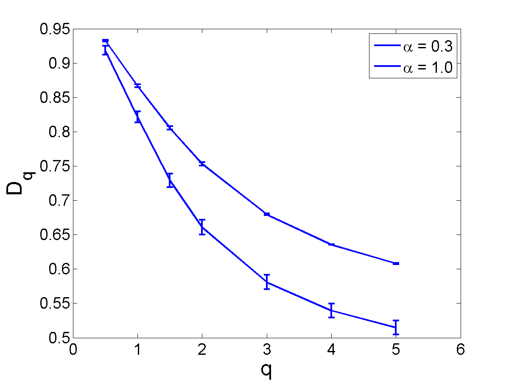

# RandomMatrix

# RandomMatrix: How to use

This is a notebook example of how to use the RandomMatrix code for Multifractality in random networks with power-law decaying bond strengths, which was employed for the analysis in [1]. The code is developed in MATLAB, and some toolboxes are necessary to run the commands. 


You run the MATLAB functions in bash/shell prompt as follow:


    matlab -nodisplay -nodesktop -nosplash -r "try; yourMATLABFunction(your parameters); catch; end; quit" 

Note: `matlab` is the environment variable in your system that calls the MATLAB program. Here, because of the Python interface, 


### Functions

The `getEtaUGraph` function shows the relative fluctations of the participation numbers ($\eta$) as a function of $\mu$ given the parameters

[PointsVar] = getEtaUGraph(Q,B,U,Ns,a)


```python
# Q: is for a specific q value
# B: the specific band
# U: the set of evaluation points for the participation numbers (x-axis)
# Ns: this is the vector of expoente network size, in the form 2^Ns[i]
# A: this is the sparcity parameter of the Power-Law Banded Random Matrix (PBRM) model.
```

##### Example of how to call the getEtaUGraph function


```python
matlab -nodisplay -nodesktop -nosplash -r "try; RandomMatrix.getEtaUGraph([2],[1],[0.6, 0.9, 1.0, 1.1],[6,7,8,9],1.0); catch; end; quit"


```





It presents the curves of $\eta$ vs $\mu$ for the dPBRM model with sparsity values $\alpha$ = 1 (no sparsity). 
The critical point is when the lines intercept.  


The next function calculates the fractal dimensions of our studied model (dPBRM) and prints the figure, i.e, the signature of the multifractality of eigenfunctions of our network model.


[Data, eData] = getDqAlphaGraphMAT(Q,B,u,Ns,A)


```python
# Q: is a vector of all the points (y-axis Figure XX of the paper)
# B: this is a vector for all the band values to be calculated
# u: it is the critical point u_c
# Ns: this is the vector of expoente network size, in the form 2^Ns[i]
# A: this is the sparcity parameter of the Power-Law Banded Random Matrix (PBRM) model.
```

##### Example of how to call the getDqAlphaGraphMAT function


```python
matlab -nodisplay -nodesktop -nosplash -r "try; RandomMatrix.getDqAlphaGraphMAT([0.5,1,1.5,2,3,4,5],[1],1,[6,7,8,9],[0.3,1.0]); catch; end; quit"

```





It creates a figure that shows the multifractal dimensions $D_q$ vs $q$ for our model. (It will take a while)

# References
You can use this code as it is for academic purpose. If you found it useful for your research, we appreciate your reference to our work Multifractality in random networks with power-law decaying bond strengths:

[1] Didier A. Vega-Oliveros, J. A. Méndez-Bermúdez, and Francisco A. Rodrigues. Phys. Rev. E 99, 042303. https://doi.org/10.1103/PhysRevE.99.042303


